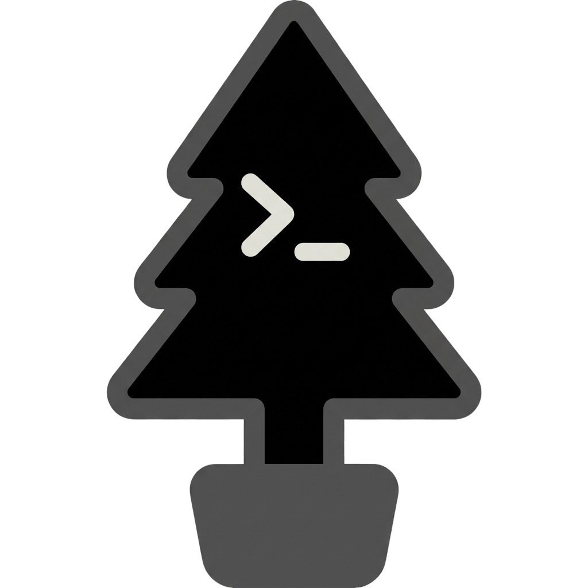

<h1 align="center">

Elka


SSH-клиент с шифрованным хранилищем

</h1>

Elka — SSH-клиент: всё хранится в зашифрованном хранилище на вашей машине. Написано на Go и React, интерфейс нативный, без Electron.

## Откуда

Проект вырос из [Terminator](https://github.com/terminator-ssh/terminator-desktop) — открытого SSH-клиента, который сам вдохновлён Termius. За основу взята его архитектура: Wails v3, Go в бэкенде, SQLite с шифрованием, Velopack для сборки установочных пакетов.

Важные для меня функции терминала которые добавил:

- разделение терминала на панели и группы вкладок с перетаскиванием;
- импорт и экспорт хостов в формате Tabby;
- настройки внешнего вида: палитры, акцентный цвет, двадцать шрифтов, шрифт и курсор терминала;
- собственный SFTP-браузер и переадресация портов;
- своё имя, своя иконка и своя система обновлений.

## Что умеет

- **Шифрованное хранилище.** Хосты, ключи, учётные данные и группы лежат в SQLite, всё защищено AES-256-GCM, ключ выводится из пароля через Argon2id.
- **Подключения.** Обычный SSH, цепочки jump-хостов, локальная и удалённая переадресация портов.
- **Терминал.** xterm.js, до восьми панелей на экране с регулируемыми размерами, группы вкладок, восстановление раскладки при переключении разделов.
- **Файлы.** Встроенный SFTP-браузер прямо из вкладки терминала.
- **Импорт и экспорт.** Формат Tabby, включая перенос метаданных профилей.
- **Внешний вид.** Тёмная и светлая палитры, синяя и зелёная, свой акцент, выбор шрифта для интерфейса и отдельные шрифт, размер и курсор терминала.
- **Два языка.** Русский и английский.
- **Обновления.** Сборка и публикация релизов по тегу, проверка новых версий по тегам GitHub прямо в настройках: скачивание установщика и его запуск.
- **Показатели сервера.** Для активной вкладки в боковом меню: нагрузка, load average, ожидание диска и память, обновление раз в секунду. Отключается в настройках.
- **Своё хранилище.** Папку с базой можно перенести в любое место диска.

## Где лежат данные

Настройки и база хранятся в `~/Library/Application Support/Elka` на macOS, в `%AppData%\Elka` на Windows и в `~/.config/Elka` на Linux.

## Сборка

Нужны Go 1.25+, Node.js 24+, pnpm и [Wails v3 CLI](https://v3.wails.io/getting-started/installation/).

```sh
wails3 dev              # разработка
wails3 task package     # сборка приложения под текущую платформу
```

macOS можно собрать в Docker, не ставя зависимости локально:

```sh
./build-macos-in-docker.sh --arch arm64 --format dmg
```

Для Intel вместо `arm64` укажите `amd64`. Без флага соберётся только `.app`.

Отладка с delve:

```sh
dlv debug --headless --listen=:2345 ./backend/cmd/elka-desktop -- dev
```

## Где что лежит

Карта модулей с подсказками, что править при изменении интерфейса, подключений или хранилища: [PROJECT_MAP_RU.md](PROJECT_MAP_RU.md).

## Благодарности

Авторам - https://github.com/terminator-ssh/terminator-desktop

<p align="center">
  
</p>